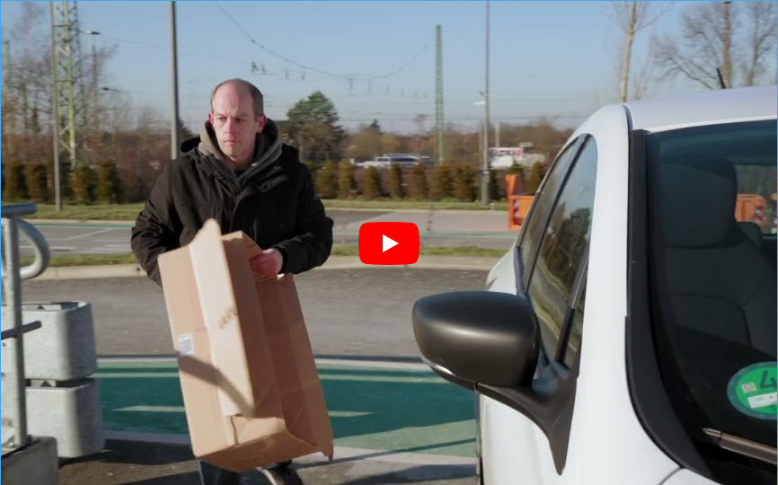

## Längere Öffnungszeiten - mehr Bürgerzufriedenheit

Um der Forderung immer längerer Öffnungszeiten gerecht zu werden, bietet der autonome Wertstoffhof eine Lösung, die sowohl Gebührenstabilität als auch Bürgerzufriedenheit durch dauerhafte Verfügbarkeit des Wertstoffhofs zu verbessern.

<!-- 

https://youtu.be/5j3IRRfMV3U?t=2

<iframe width="660" height="480" src="https://www.youtube.com/embed/5j3IRRfMV3U" title="Umweltbetriebe-Autonomer Wertstoffhof" frameborder="0" allow="accelerometer; autoplay; clipboard-write; encrypted-media; gyroscope; picture-in-picture; web-share" allowfullscreen></iframe>

<iframe width="905" height="491" src="https://www.youtube.com/embed/5j3IRRfMV3U" title="Umweltbetriebe-Autonomer Wertstoffhof" frameborder="0" allow="accelerometer; autoplay; clipboard-write; encrypted-media; gyroscope; picture-in-picture; web-share" allowfullscreen></iframe>

<iframe width="662" height="150" src="https://www.youtube.com/embed/5j3IRRfMV3U" title="Umweltbetriebe-Autonomer Wertstoffhof" frameborder="0" allow="accelerometer; autoplay; clipboard-write; encrypted-media; gyroscope; picture-in-picture; web-share" allowfullscreen></iframe>

<iframe width="960" height="150" src="https://www.youtube.com/embed/5j3IRRfMV3U" title="Umweltbetriebe-Autonomer Wertstoffhof" frameborder="0" allow="accelerometer; autoplay; clipboard-write; encrypted-media; gyroscope; picture-in-picture; web-share" allowfullscreen></iframe> -->

<!-- <figure class="video_container">
    <iframe width="100%" height=auto src="https://www.youtube.com/embed/5j3IRRfMV3U" title="Umweltbetriebe Autonomer Wertstoffhof" frameborder="0" allow="accelerometer; autoplay; clipboard-write; encrypted-media; gyroscope; picture-in-picture; web-share" allowfullscreen></iframe>
</figure>
(Bildquelle: media-continuo.com) -->

<!-- <figure class="video_container">
  <video width="100%"  controls="true" allowfullscreen="true" poster="img/20240119145212.png">
    <source src="https://www.youtube.com/embed/5j3IRRfMV3U" type="video/mp4">
  </video>
</figure>
(Bildquelle: media-continuo.com) -->

<!-- Responsive Video Container -->

    <iframe width="560" height="315" src="https://www.youtube.com/embed/5j3IRRfMV3U?start=1" title="Umweltbetriebe Autonomer Wertstoffhof" frameborder="0" allow="accelerometer; autoplay; clipboard-write; encrypted-media; gyroscope; picture-in-picture; web-share" allowfullscreen></iframe>

(Bildquelle: media-continuo.com)

<!-- 

<iframe width="100%" height="100%" src="https://www.youtube.com/embed/5j3IRRfMV3U" title="Umweltbetriebe Autonomer Wertstoffhof" frameborder="0" allow="accelerometer; autoplay; clipboard-write; encrypted-media; gyroscope; picture-in-picture; web-share" allowfullscreen></iframe>
(Bildquelle: media-continuo.com) -->

<!-- 
(Bildquelle: media-continuo.com) -->

[Link zum Video: Umweltbetriebe - Autonomer Wertstoffhof.mp4](https://youtu.be/5j3IRRfMV3U)

